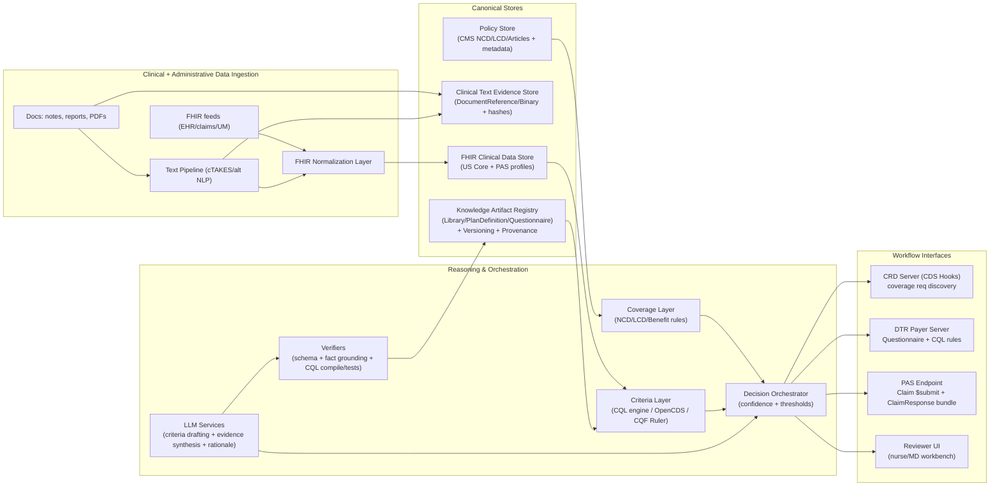
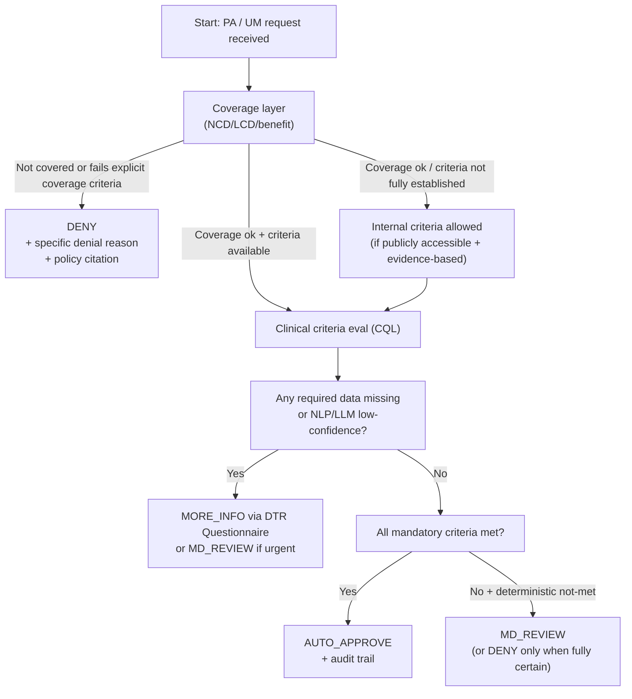

# Building an LLM-Augmented Utilization Management Criteria Engine Using Open Standards and Public Medicare Policy

## Executive summary

A strategically sound UM Criteria Engine is not “an LLM that reads charts and decides.” It is a **multi-layer decision system** that (a) normalizes clinical and administrative data into **FHIR**; (b) executes **deterministic, auditable criteria** expressed in a computable rule format (primarily **HL7 CQL**, packaged as FHIR Clinical Reasoning artifacts); (c) uses **NLP (e.g., cTAKES)** to convert unstructured documents into structured, time-aware facts; and (d) uses **LLMs only where they excel**: extracting policy intent, synthesizing evidence, drafting criteria/rules, and producing human-readable rationales—*while being continuously verified by rule engines and data validators*. This aligns with how interoperable payer/provider workflows are being standardized via **HL7 Da Vinci CRD/DTR/PAS** and **CDS Hooks**. citeturn25view0turn20view0turn28view1turn30view0turn0search0turn5search0

Two external forces should shape your architecture from day one. First, CMS’s **Interoperability and Prior Authorization Final Rule (CMS‑0057‑F)** requires impacted payers to implement FHIR APIs and to provide timely PA decisions and **specific denial reasons**, with operational requirements beginning in 2026 and API requirements generally beginning in 2027. citeturn13view0 Second, CMS guidance for Medicare Advantage coverage criteria stresses that tools (including algorithms/AI) may assist, but **coverage decisions must be based on the individual patient’s circumstances** and must align with fully established Traditional Medicare coverage criteria (statutes/regulations/NCDs/LCDs); internal criteria are allowed only when Medicare criteria are not fully established, and must be publicly accessible. citeturn12view0turn12view1

The most strategic build plan is a **hybrid stack**:

* **Standards-first interoperability**: implement CRD (coverage discovery), DTR (documentation templates + rules), and PAS (prior auth submission/response) endpoints so your engine can operate “in the workflow” using CDS Hooks and FHIR bundles. citeturn20view0turn28view1turn30view0turn25view0  
* **Deterministic rules as the source of truth**: represent enforceable criteria in **CQL**; package them as **FHIR Library/PlanDefinition/Questionnaire** artifacts per the FHIR Clinical Reasoning approach. citeturn0search0turn5search0turn5search1turn28view1turn26search9  
* **LLM as an authoring + explanation copilot**: use LLMs for (i) policy-to-rule compilation drafts, (ii) evidence synthesis summaries, and (iii) narrative-style rationales—but require every clinical claim to be **grounded to FHIR facts** and verified, and every generated rule to be **compiled, unit-tested, and regression-tested** before it can affect determinations. citeturn26search0turn6search1turn6search2turn7search3  
* **NLP for clinical text**: use cTAKES (or alternatives) for concept extraction plus **assertion (negation/uncertainty/experiencer)** and **temporality**, with outputs mapped into FHIR resources and provenance-tracked. citeturn23search4turn8search3turn23search2turn23search0  
* **Policy ingestion from CMS**: ingest NCD/LCD/Article content using the **Medicare Coverage API** and/or MCD downloads. Do not underestimate licensing constraints around CPT/CDT and how you store or expose them—CMS’s own MCD download page includes explicit CPT and CDT license restrictions (including restrictions related to commercial/AI outputs). citeturn11view0turn31view0

Bottom line: you can build a system that behaves like “nurse reviewer + criteria engine,” but only if you treat **LLMs as untrusted** and build a tight verification-and-audit loop around them. CMS’s own MA guidance is explicit that predictive/aggregate-data algorithms alone cannot be the basis for denial/downgrade decisions; your design must preserve case-by-case, evidence-backed adjudication and ensure explainability/auditability. citeturn12view1turn13view0

## System components and end-to-end data flows

### Reference architecture

This architecture intentionally separates **knowledge**, **facts**, **reasoning**, and **explanations**, so you can improve any layer without corrupting the others.



This aligns naturally with the **Da Vinci Burden Reduction** pattern where CRD determines whether documentation/prior authorization is required, DTR retrieves questionnaires and rules (CQL) and pre-populates/validates documentation, and PAS submits the authorization request/response bundles. citeturn20view0turn28view1turn30view0turn17view0turn25view0

### Workflow integration strategy: CRD, DTR, PAS as “front doors”

If you want this to be strategic (not a toy), do not build a bespoke API first. Instead, implement:

* **CRD server**: called via CDS Hooks at ordering/appointment points so you can return coverage requirement and documentation/PA needs “in workflow.” CRD explicitly defines this objective—payer requirements surfaced inside provider systems at point-of-care. citeturn20view0turn14view2turn25view0  
* **DTR payer server**: serves the payers’ **Questionnaire(s)** and **CQL rules**, enabling pre-population and validation of documentation requirements; the DTR use cases section explicitly describes retrieving rules (CQL) + questionnaires and checking whether entered/pre-populated data satisfies requirements. citeturn28view1  
* **PAS endpoint**: accepts a prior authorization request as a FHIR submission (Claim + referenced resources in a Bundle) and emits an adjudication response (ClaimResponse bundle). The PAS IG defines these artifacts and positions PAS as complementary to CRD/DTR for completeness and efficiency. citeturn30view0turn17view0turn17view2

This is directly aligned with CMS‑0057‑F’s push toward **FHIR-based prior authorization APIs** and predictable turnaround/denial reason communication. citeturn13view0turn30view0

## Concrete data models: FHIR resources, terminologies, and mapping rules

### Canonical clinical + UM data model

CQL and CDS workflows work best when your data is **FHIR R4 (4.0.1)** aligned and constrained by **US Core** and **Da Vinci PAS/CRD/DTR** profiles (where applicable). CMS‑0057‑F explicitly references FHIR R4.0.1 and US Core IG STU 3.1.1 as foundational standards. citeturn13view0turn30view0turn17view0turn4view6

A practical UM criteria engine data model typically uses:

**Patient identity and coverage**
- `Patient` (subject)  
- `Coverage` (plan/benefit context; also used heavily in CRD/PAS ecosystems) citeturn20view0turn17view0  
- `Organization` / `Practitioner` / `PractitionerRole` for requestors, rendering, insurer identity (PAS defines specific profiles). citeturn17view0  

**Clinical facts**
- `Condition` for problems/diagnoses (problem list + encounter diagnoses). citeturn4view4  
- `Observation` for vitals and lab values; Observations are central to diagnosis/monitoring and form the atomic units for many criteria checks. citeturn4search1turn4search5  
- `DiagnosticReport` for grouped lab/imaging results and narrative reporting (US Core uses DiagnosticReport + DocumentReference for clinical notes and reports). citeturn4search6turn4search10  
- `Procedure` (performed services), `ServiceRequest` (ordered services), `MedicationRequest` (ordered medications), `DeviceRequest` (ordered DME) where relevant; PAS profiles include ServiceRequest/MedicationRequest/DeviceRequest for requested services. citeturn17view0  

**Documents and unstructured evidence**
- `DocumentReference` to index clinical notes, discharge summaries, consult notes, etc. citeturn4search2turn4search6  
- `Binary` to store raw payloads (PDFs, scans) referenced from DocumentReference (preferred over embedding base64 in many operational systems).

**Prior authorization request/response**
- `Claim` with `use = preauthorization` is the core FHIR financial “request” pattern, and the Claim resource explicitly distinguishes preauthorization use. citeturn4search11turn4search19  
- `ClaimResponse` provides adjudication results and is used for processing claims and preauthorization-style flows. citeturn4search7turn4search3  
- PAS constrains these via the PAS Claim / PAS Claim Response profiles and bundles. citeturn17view0turn17view2  

**Decision outputs and auditability**
- `GuidanceResponse` is designed to represent the result of invoking a decision support service and is aligned to CDS Hooks interactions, making it a natural record format for “what the engine decided and why.” citeturn5search5turn5search2  
- `Provenance` + `AuditEvent` (and potentially `Task`) for traceability: which artifacts, which rule versions, which model prompts, which evidence was used. (FHIR’s Clinical Reasoning module explicitly targets representation and evaluation of knowledge artifacts.) citeturn5search0turn5search2  

### Terminologies and code systems

Your mapping strategy should standardize code systems at ingestion so criteria logic isn’t brittle:

| Domain | Primary code systems | Notes / why it matters |
|---|---|---|
| Diagnoses/conditions | ICD‑10‑CM for billing alignment; SNOMED CT for clinical problems | VSAC hosts value sets built from standard vocabularies (including SNOMED CT, RxNorm, LOINC) for interoperable definitions; SNOMED CT often requires licensing. citeturn9search0turn9search4 |
| Labs / measurements | LOINC + UCUM units | LOINC is widely used and generally free-to-use except creating a competing code system; UCUM supports unambiguous electronic communication of units. citeturn9search6turn9search2turn9search15turn9search3 |
| Medications | RxNorm | RxNorm provides normalized drug names and IDs to enable interoperability across drug vocabularies. citeturn9search1turn9search13 |
| Procedures/services | CPT/HCPCS, ICD‑10‑PCS (inpatient procedures) | Watch licensing constraints: CMS’s MCD downloads page includes explicit CPT licensing limitations (non-commercial/personal use) and other license language. Treat this as a legal design constraint, not an afterthought. citeturn31view0 |

**Critical trap:** if your criteria engine outputs CPT/CDT content in ways prohibited by license terms, you can create real commercial/legal exposure. CMS’s MCD download page explicitly lays out license agreements and restrictions, including statements limiting CPT use to non-commercial/personal use and restrictions on unauthorized redistribution/derivative works. citeturn31view0

### Mapping rules from your “owned data” to FHIR

A strategic approach is to define **mapping contracts** that produce FHIR resources that are:

1) minimally sufficient for criteria evaluation,  
2) provenance-tracked to source documents, and  
3) stable under versioning.

Practical mapping rules (high-value examples):

**Diagnoses → Condition**
- Source fields: ICD‑10 diagnosis code(s); encounter problem list; admitting diagnosis.  
- Map to: `Condition.code` (ICD‑10‑CM and/or SNOMED translation), `Condition.encounter`, `Condition.onset[x]`, `Condition.clinicalStatus`, `Condition.verificationStatus`.  
- If derived from NLP: write `Condition.evidence.detail` referencing `DocumentReference` plus `Provenance` linking extraction run + offsets.

**Labs → Observation + DiagnosticReport**
- Source fields: test code, value, reference range, collection time, specimen, performing lab.  
- Map to: `Observation.code` (LOINC), `Observation.value[x]`, `Observation.effective[x]`, `Observation.interpretation`, `Observation.referenceRange`, `Observation.note`, `Observation.derivedFrom` (if computed).  
- Group into `DiagnosticReport.result` where tests are part of a panel; US Core recognizes DiagnosticReport + DocumentReference as key for notes and reports exchange. citeturn4search6turn4search9

**Authorization request → PAS Bundle centered on Claim (use=preauthorization)**
- Source fields: request type (inpatient admit, outpatient procedure), service(s) requested, provider, facility, urgency, dates, clinical attachments.  
- Map to: PAS Claim profile + referenced `ServiceRequest` / `DeviceRequest` / `MedicationRequest` where appropriate (PAS artifacts list includes these profiles). citeturn17view0turn30view0  

## Knowledge and rules: representation strategy, examples, and CMS policy ingestion

### Rule representation strategy: use a tiered approach, not one format

A strategic criteria engine uses **multiple representations**, each where it fits best:

**Tier for enforceable determinations (primary): HL7 CQL**
- CQL is an HL7 standard designed for expressing clinical logic and is used across CDS and measurement contexts. citeturn0search0turn0search8turn26search6  
- The Clinical Reasoning module provides the surrounding FHIR constructs to distribute and evaluate artifacts (rules, protocols, evidence summaries). citeturn5search0turn5search5  

**Tier for questionnaire-driven documentation rules: CQL + Questionnaire (DTR pattern)**
- DTR explicitly describes retrieving **Questionnaire resources and rules (CQL)**, pre-populating responses from EHR data, and checking if documentation satisfies requirements. citeturn28view1  

**Tier for guideline workflow orchestration: PlanDefinition / ActivityDefinition**
- PlanDefinition is intended for sharable and executable plans, including clinical decision support rules and protocols. citeturn5search1turn5search0  

**Optional: openEHR GDL2 and OpenClinical/PROforma for computable guideline models**
- GDL2 is a formal language for decision support logic and is explicitly designed to be data-binding agnostic (including bindings to FHIR). citeturn3search0turn3search4  
- OpenClinical’s platform focuses on executable guideline models (“publets”) that can prompt compliance and provide explanations/evidence “on demand.” citeturn1search1turn1search17turn3search13  
This is useful if you expect complex pathway-like guidelines that aren’t just “if-then coverage criteria.”

**Engineering reality:** pick **CQL as the normative decision layer** even if you allow secondary encodings. Otherwise you’ll drown in translation debt and lose auditability.

### Example: canonical criteria DSL → compiled to CQL + DTR Questionnaire

A workable approach is to maintain an internal “Criteria DSL” as the single authoring interface, then compile into CQL/Questionnaire artifacts. Example DSL (conceptual):

```yaml
criteriaSetId: "UM.INPATIENT.ADMISSION.ACUTE_RESP_FAILURE.v1"
scope:
  setting: inpatient
  requestType: admission
requires:
  - fact: "O2Sat"
    operator: "<"
    value: 90
    unit: "%"
    lookback: "6 h"
  - fact: "RespiratoryFailureDiagnosis"
    operator: "present"
decision:
  approveIfAllMet: true
escalateIfMissingData: true
denyIfClearlyNotMet: true
```

**Compilation targets:**
1) **CQL** to compute met/not-met with precise lookbacks.
2) **Questionnaire** (DTR) to gather missing data elements and attest clinician input.
3) **CRD Card** templates to tell providers exactly what’s needed.

### Sample CQL snippets

CQL example showing patterns you’ll reuse (terminology + lookback logic + fact checks). CQL itself is standardized and meant for these types of computable definitions. citeturn0search0turn5search0turn26search9

```cql
library UM_InpatientAdmission_AcuteRespFailure version '1.0.0'

using FHIR version '4.0.1'
include FHIRHelpers version '4.0.1'

codesystem "ICD10CM": 'http://hl7.org/fhir/sid/icd-10-cm'
codesystem "LOINC": 'http://loinc.org'

code "Acute respiratory failure, unspecified": 'J96.00' from "ICD10CM"
code "Oxygen saturation in Arterial blood by Pulse oximetry": '59408-5' from "LOINC"

context Patient

define "Has Acute Respiratory Failure Diagnosis":
  exists (
    [Condition: "Acute respiratory failure, unspecified"] C
      where C.clinicalStatus.coding.code in { 'active', 'recurrence', 'relapse' }
  )

define "Recent O2 Sat < 90":
  exists (
    [Observation: "Oxygen saturation in Arterial blood by Pulse oximetry"] O
      where O.effective as dateTime >= (Now() - 6 hours)
        and (O.value as Quantity).value < 90
  )

define "AdmissionCriteriaMet":
  "Has Acute Respiratory Failure Diagnosis" and "Recent O2 Sat < 90"
```

Implementation note: treat this as illustrative. In production you’ll (a) bind value sets via VSAC where possible, (b) normalize units via UCUM, and (c) attach each derived result to a `GuidanceResponse`/audit record for traceability. citeturn9search0turn9search3turn5search5

### CMS NCD/LCD ingestion, parsing, and mapping to computable logic

You should build the CMS ingestion pipeline as if it were its own product because it will constantly break otherwise.

**Authoritative sources and access paths**
- **Medicare Coverage API**: provides programmatic access to national and local coverage data in the Medicare Coverage Database (MCD). API keys are not required as of Feb 8, 2024, and CMS documents throttling constraints. citeturn11view0  
- **MCD downloads**: zipped datasets with a Read Me + dataset + data dictionary; only the latest version of each document appears in downloads (in-effect, future effective, or retired). citeturn31view0  

**Non-obvious but critical structural detail**
- CMS indicates CPT/HCPCS and ICD‑10 code mappings are now found in **Articles**, not LCDs (except certain DME LCDs). So you must ingest LCDs *and* Articles and join them correctly. citeturn31view0  
- Attachments for LCDs/Articles/NCDs are not necessarily included in downloads and may require fetching from document views, so your pipeline needs a “secondary fetch” capability. citeturn31view0turn1search15  

**Recommended ingestion pipeline**
1) **Fetch metadata and HTML bodies** via Coverage API and/or MCD downloads; store a raw “policy snapshot” per version. citeturn11view0turn31view0  
2) **Document segmentation**: split policy text into sections (Indications, Limitations, Coding, Documentation Requirements, Frequency).  
3) **Structured extraction step** (LLM-assisted, but verified): extract discrete conditions like “must have diagnosis in set X,” “must have lab threshold Y within T,” “requires prior conservative therapy,” etc.  
4) **Join code tables**: join LCD ↔ Articles per MCD structure and persist a “coverage criteria graph”:  
   - Service codes (HCPCS/CPT)  
   - Diagnoses (ICD‑10‑CM)  
   - Place of service constraints, frequency, age/sex constraints  
5) **Compile to CQL**: generate a `Library` with named expressions per criterion, plus a top-level `CoverageEligible` expression.  
6) **Regression test**: every compiled policy must ship with test cases and fixtures; if you can’t test it, you can’t auto-adjudicate.

**Hard constraint: code licensing**
Do a licensing review *early*. The CMS MCD downloads page includes explicit license language for CPT and CDT usage and limitations. If your product is commercial and depends on CPT content, you may need separate licensing arrangements, and you must design your system to avoid redistributing restricted tables in ways not allowed. citeturn31view0

## LLM and NLP: roles, prompt templates, grounding, verification, and cTAKES pipeline design

### LLM roles that are strategic (and roles that are reckless)

**Strategic LLM roles**
- **Criteria drafting / transformation**: convert narrative policies/guidelines into candidate structured criteria artifacts (your DSL → CQL/Questionnaire).  
- **Evidence synthesis**: summarize supporting evidence *already available* in your policy store and/or approved guideline library; generate explanations tailored to nurse/MD review.  
- **Chart narrative summarization for reviewers**: “Here are the core facts with sources,” not “here’s my opinion.”  
- **Data quality detection**: flag missing or contradictory documentation and propose DTR questions.

**Reckless LLM roles (don’t do this)**
- Letting LLMs be the only decision-maker for denial/downgrade decisions. CMS MA guidance explicitly emphasizes individualized evaluation and warns against algorithmic decisions based on larger datasets rather than the individual patient context; algorithms/AI can assist but must comply with the rules for coverage determinations. citeturn12view1turn12view0

### Input shaping: how to feed “FHIR context” without melting the model or losing auditability

The most robust pattern is: **FHIR → deterministic feature extraction → compact “case facts” object** plus **selective raw evidence**.

1) Use **CDS Hooks prefetch** to retrieve the minimum dataset a service needs; CDS Hooks explicitly supports prefetch queries advertised at discovery time. citeturn25view0  
2) Build a “Case Facts” JSON produced deterministically from FHIR (and NLP outputs).  
3) Provide only **bounded excerpts** from relevant documents (note snippets) when needed for clinical nuance; store and reference document hashes and offsets.

### Output schemas: force structure and enforce validation

A practical output schema for UM determination:

```json
{
  "determination": "AUTO_APPROVE | MD_REVIEW | DENY | MORE_INFO",
  "confidence": 0.0,
  "policyBasis": [
    {
      "policyType": "NCD | LCD | Article | Internal",
      "policyId": "string",
      "policyVersion": "string"
    }
  ],
  "criteriaResults": [
    {
      "criterionId": "string",
      "description": "string",
      "status": "MET | NOT_MET | UNKNOWN",
      "evidence": [
        {
          "fhirRef": "Observation/123",
          "path": "Observation.valueQuantity.value",
          "valueSeen": "89",
          "effectiveTime": "2026-02-13T10:15:00-05:00",
          "sourceDoc": {
            "documentReference": "DocumentReference/77",
            "offsetStart": 1052,
            "offsetEnd": 1123,
            "quoteHash": "sha256:..."
          }
        }
      ]
    }
  ],
  "denialOrEscalationRationale": {
    "summary": "string",
    "missingInfoRequests": [
      { "questionnaireItemLinkId": "string", "reason": "string" }
    ]
  },
  "audit": {
    "cqlLibraryVersion": "string",
    "artifactBundleId": "string",
    "llm": {
      "model": "string",
      "promptVersion": "string",
      "inputHash": "sha256:...",
      "outputHash": "sha256:..."
    }
  }
}
```

Your pipeline must reject any LLM output that fails schema validation, contains evidence references that don’t exist in FHIR, or cites values that don’t match the referenced resource/path.

### Prompt templates you can actually operationalize

**Prompt template for criteria generation (policy → structured criteria draft)**  
Use when ingesting a new NCD/LCD/Article or guideline.

> **System**: You are a policy-to-criteria compiler. You must only use the provided policy text. Do not invent requirements. Output valid JSON matching the schema.  
> **User**:  
> Policy metadata: `{policyId, type, version, effectiveDate}`  
> Policy text (segmented): `{indications, limitations, documentation, coding}`  
> Task:  
> 1) Extract atomic criteria as boolean predicates.  
> 2) Identify required documentation fields suitable for a DTR Questionnaire.  
> 3) Propose a canonical Criteria DSL representation.  
> Output JSON with: `criteriaPredicates[]`, `requiredDataElements[]`, `questionnaireDraft[]`, `traceability[]` (section+sentence indices).

**Prompt template for case adjudication (facts + criteria → determination proposal)**  
Use only after deterministic engines have computed initial results.

> **System**: You are a UM reviewer assistant. You must not make up clinical facts. Every criterion status must include evidence references to provided FHIR IDs/paths. If evidence is missing, mark UNKNOWN and request information via Questionnaire items.  
> **User**:  
> CaseFacts JSON (deterministic): `{...}`  
> CriteriaSet JSON: `{...}`  
> Prior CQL evaluation results: `{criterionId -> MET/NOT_MET/UNKNOWN}`  
> Task: produce Determination JSON.

This pattern keeps the LLM “boxed in” and makes the deterministic evaluation the backbone.

### Hallucination mitigation and verification loops

A robust mitigation strategy is to treat the LLM as a **proposal engine** and run layered verification:

1) **FHIR grounding validator**: for each cited evidence item, verify the resource exists and the path/value matches the output.  
2) **CQL compile-and-run**: if the LLM generated or modified CQL, run it through a translator/engine and execute unit tests before acceptance; the CQF ecosystem provides translation services and engines. citeturn26search9turn26search6turn26search0  
3) **Policy traceability constraint**: every generated criterion must link back to a policy section.  
4) **Disagreement triggers**: if LLM narrative conflicts with CQL outcome, escalate to human review and log the conflict.

### NLP pipeline design: cTAKES configuration for UM needs

cTAKES is designed to extract codable entities from clinical free-text and includes modules for **temporal events** and scalable processing. citeturn23search4turn1search2turn23search1

**Core pipeline design**
- Start with **Fast Dictionary Lookup** to normalize mentions to ontology codes; Apache’s docs describe that fast lookup identifies terms and normalizes to codes like UMLS CUI, SNOMED CT, RxNorm, etc. citeturn23search3  
- Run **Assertion** to assign negation/uncertainty/generic/historical/experiencer; Apache documentation emphasizes that mention ≠ asserted patient condition and explains negation, uncertainty, and “subject other than patient.” citeturn8search3turn8search11  
- Run **Temporal module** to extract events and temporal expressions and relate them on a timeline. This matters for UM lookbacks (“failed conservative therapy in last 6 weeks,” “O2 sat within 6 hours,” etc.). citeturn23search2  
- Emit outputs into a structured format; cTAKES has FHIR-related output capability (FHIR JSON writer) that can support downstream mapping workflows. citeturn23search0  

**UM-specific post-processing**
- Convert extracted problems/tests/treatments into candidate FHIR `Condition`, `Observation`, `Procedure`, `MedicationStatement`/`MedicationRequest` facts with:  
  - assertion flags (negated/uncertain/subject),  
  - temporality (effective time / onset / abatement), and  
  - `Provenance` ties back to `DocumentReference` and offsets.

**Alternative / complementary NLP**
If cTAKES setup overhead or UMLS dictionary management becomes a bottleneck, medspaCy provides a clinical NLP toolkit pipeline approach (spaCy-based), and ConText/NegEx-style assertions have well-established literature. citeturn8search0turn8search2turn8search6  
Strategically, however, if you’re building an enterprise UM engine, the **assertion + temporality** features are not optional—without them you will approve/deny based on “mentions” rather than “facts.”

## Decision orchestration, compliance, testing, metrics, and roadmap

### Decision orchestration: thresholds and escalation logic

CMS‑0057‑F pushes for transparent, timely prior authorization operations and denial reasons. citeturn13view0 CMS MA guidance stresses individualized decision-making and prohibits algorithm-only bases for denial/downgrade. citeturn12view1turn12view0 Your orchestration should therefore be conservative about denials and aggressive about **escalation when uncertain**.

A pragmatic, defensible decision policy:



**Confidence scoring components**
- **Data completeness score**: proportion of required elements available in FHIR vs missing.  
- **NLP assertion certainty**: penalize negated/uncertain/hypothetical findings. citeturn8search3turn23search2  
- **Rule determinism score**: CQL met/not-met derived only from structured facts (highest trust).  
- **LLM trust score**: always secondary; down-weight when any unverified extraction exists.

**Strategic insistence:** “AUTO_APPROVE” should be allowed only when the CQL layer is satisfied using high-quality structured inputs; LLM output should not be the deciding evidence.

### Governance, versioning, and audit trails

**Policy governance requirements (Medicare/MA constraints)**
- MA plans must make medical necessity determinations based on individual circumstances and fully established Traditional Medicare coverage criteria including NCDs/LCDs; internal criteria are allowed only when Medicare coverage criteria are not fully established and must be publicly accessible and evidence-based. citeturn12view0  
- CMS clarifies that AI/algorithms may assist, but the MA organization must ensure compliance and decisions can’t be based on larger datasets instead of the patient’s own medical history/physician recommendations/clinical notes. citeturn12view1  
- CMS‑0057‑F also requires communicating approval/denial/more-info and **specific denial reasons**, and sets operational decision timeframes (urgent vs standard). citeturn13view0  

**Operational governance model**
- **Knowledge artifact registry**: treat every rule set as a versioned artifact bundle (FHIR `Library`, `PlanDefinition`, `Questionnaire`, plus metadata). The Clinical Reasoning module exists to support representation/distribution/evaluation of these artifacts. citeturn5search0turn17view0  
- **Immutable audit records per case**: store `GuidanceResponse` + `Provenance` + `AuditEvent` capturing:  
  - policy versions used,  
  - CQL library versions,  
  - NLP pipeline version/dictionaries,  
  - LLM model + prompt version + input/output hashes,  
  - reviewer overrides and reasons.  
  (GuidanceResponse is explicitly designed to represent results of a decision support invocation and is aligned with CDS Hooks.) citeturn5search5turn5search2turn25view0  

**HIPAA/security fundamentals**
If you use any external LLM service with PHI, you must address HIPAA obligations: business associate relationships and security safeguards for ePHI. HHS OCR guidance explains what a business associate is, and the Security Rule requires administrative/physical/technical safeguards. citeturn21search0turn21search1turn21search3

### Testing and validation strategy

You need three validation tracks: **conformance**, **clinical correctness**, and **LLM safety**.

**Conformance testing (FHIR/Da Vinci)**
- Use Inferno test kits for Da Vinci PAS (and DTR) where applicable; the PAS test kit validates conformance and is built on the Inferno Framework. citeturn26search1turn18search7  

**CQL correctness testing**
- Use the AHRQ **CQL Testing Framework** to develop/run test cases validating CQL-based logic regardless of how the CQL was produced. citeturn26search0  
- Maintain golden test vectors per policy version; every policy update should run regression tests before deployment.

**Clinical validation**
- Retrospective replay: run the engine on historical authorizations with known outcomes; measure concordance, turnaround, and reasons.  
- Dual-review trials: for a period, run the engine in shadow mode and compare to nurse/MD reviewers; analyze discrepancies by category (data gap, policy parsing error, NLP false assertion, etc.).

**LLM validation**
- Measure hallucination rate as “% outputs containing unverifiable FHIR references or mismatched values.”  
- Stress tests: conflicting/missing data; adversarial notes; ambiguous temporality; ensure system escalates rather than guesses.

### Metrics and evaluation datasets

**Core UM operational metrics (production)**
- Median/95th percentile decision time; urgent vs standard (aligning with CMS‑0057‑F expectations for timeframes and denial reasons). citeturn13view0  
- Auto-approve rate vs MD review rate vs deny rate, by service line.  
- Overturn rate on appeal and reasons (a critical safety metric).  
- “More info” request frequency and documentation completion times (DTR effectiveness).

**Modeling and NLP evaluation datasets**
- **Synthea** for synthetic patient generation (privacy-safe) to create FHIR cohorts and predictable scenarios for regression testing. citeturn22search4turn22search0  
- **n2c2 (formerly i2b2 challenges)** datasets for clinical NLP tasks (concept extraction, assertions, relations) under DUA; useful for benchmarking assertion/negation pipelines. citeturn22search6turn22search14  
- **MIMIC-IV demo / MIMIC-IV** for research-grade clinical data (with credentialed access), useful for building robust temporality and lab-based criteria scenarios. citeturn22search1turn22search9  

### Phased roadmap with concrete deliverables

**Phase foundation: standards + data**
- Deliverables: FHIR R4 store; normalization mappings; PAS bundle ingestion for prior auth requests; DocumentReference/Binary evidence store; initial audit log scaffolding.  
- Success criteria: can ingest a complete PA case and render it in a reviewer UI with traceable sources.

**Phase policy ingestion: CMS coverage as computable assets**
- Deliverables: Coverage API ingestion service; MCD downloads processor; LCD↔Article join logic; policy snapshot/versioning; initial “policy-to-criteria DSL” extraction (LLM-assisted but human-reviewed). citeturn11view0turn31view0  
- Success criteria: for chosen pilot services, system can compute coverage eligibility outputs with clear policy links.

**Phase deterministic criteria engine: CQL-first**
- Deliverables: CQL compilation pipeline; Library/PlanDefinition packaging; evaluation runtime (e.g., CQF Ruler or AHRQ CQL Services); test harness and regression suite. CQF Ruler is explicitly designed as a FHIR server with Clinical Reasoning plugins and CDS Hooks compatibility. citeturn7search0turn7search10turn26search9

**Phase NLP: cTAKES pipeline into FHIR facts**
- Deliverables: cTAKES service deployment configured for UM (dictionary + assertion + temporal); mapping to FHIR facts with provenance; measurable precision/recall on n2c2-like tasks. citeturn23search4turn8search3turn23search2

**Phase workflow integration: CRD + DTR + PAS**
- Deliverables: CRD server endpoints responding to hook calls; DTR endpoints serving Questionnaires + rules; PAS response generation; conformance tested via Inferno. citeturn20view0turn28view1turn30view0turn26search1

**Phase LLM augmentation: controlled authoring + explainability**
- Deliverables: prompt/version registry; structured output enforcement; evidence grounding validator; “LLM as drafter” for new criteria plus mandatory test case generation; reviewer-facing rationale generator tied to FHIR evidence and policy sections.  
- Success criteria: measurable reduction in nurse reviewer time with stable/low hallucination rates and improved documentation completeness.

## Alternatives comparison tables: rule engines, LLMs, hosting, and cost structure

### Rule engine and clinical reasoning stack options

| Option | What it gives you | Strengths | Risks / limits |
|---|---|---|---|
| **CQF Ruler (HAPI FHIR + Clinical Reasoning plugins + CDS Hooks)** | A FHIR server with Clinical Reasoning operations, knowledge repository, and CDS Hooks compatible service behavior citeturn7search0turn7search10 | Best “CQL-native” path; integrates with FHIR artifacts and CDS patterns; aligns with Clinical Reasoning module concepts citeturn5search0turn7search0 | Requires Java/HAPI operational maturity; may need customization for UM-specific artifacts |
| **AHRQ CDS Connect CQL Services** | Express.js service exposing CQL via REST and CDS Hooks; supports FHIR R4 detection from library citeturn26search11turn7search2 | Lightweight; good for prototype and microservice execution; connected to CDS Hooks patterns | Prototype lineage; you’ll likely harden it for enterprise scale and audit requirements |
| **OpenCDS** | Standards-based CDS platform; supports CDS Hooks + FHIR; rules can be Java/Drools; CQL listed as future support citeturn24view0 | Mature CDS concept; Drools fits complex rule logic; multi-environment support | CQL support not inherently “done”; bridging UM CQL artifacts may require adapter work citeturn24view0 |
| **openEHR GDL2 execution engines** | Production-rule CDS language designed to be data-binding agnostic, including FHIR binding citeturn3search0 | Strong for rule-style guidelines; potentially expressive for scoring logic | Additional ecosystem and tooling decisions; translation/audit complexity if mixed with CQL |
| **OpenClinical / PROforma** | Executable guideline “publets” that can provide explanations and supporting evidence citeturn1search1turn3search13 | Great for pathway-like guideline modeling; built-in explanation concept | Less directly aligned to Da Vinci payer workflows; integration effort for UM/PA artifacts |

### LLM model options and cost structures (representative, pricing-sensitive)

| Category | Examples | Typical cost unit | Notes for PHI / UM |
|---|---|---|---|
| Hosted proprietary API | OpenAI API pricing published on OpenAI sites citeturn27search0turn27search4 | Per input/output tokens | Requires strict data handling; you must address HIPAA/business associate obligations if PHI is transmitted citeturn21search0turn21search1 |
| Hosted proprietary API | Anthropic Claude pricing examples (e.g., Opus pricing cited publicly) citeturn27search1turn27search5 | Per input/output tokens + caching/batch discounts | Favor strong output-structure enforcement; consider prompt caching for repeated policy compilation workloads citeturn27search1 |
| Hosted proprietary API | Google Gemini Developer API and/or Vertex AI published pricing citeturn27search2turn27search6 | Per 1M tokens, plus options like grounding/caching | If you use “grounding” features, treat the retrieved sources as part of the audit evidence chain citeturn27search2 |
| Self-hosted “open weight” models | Llama-family license terms vary and are not OSI open source in the classic sense; review license carefully citeturn27search7turn27search3 | GPU/infra cost + ops | Strong option when PHI constraints require full on-prem control; cost is engineering + compute rather than per-token billing |

**Strategic point:** compute costs are not your main risk. Your main risk is **making un-auditable or non-compliant denials** based on unverified model behavior—something CMS explicitly pushes back on in MA guidance. citeturn12view1turn13view0

### Hosting options and “open vs commercial” cost framing

| Hosting approach | Open-stack components | Commercial components | Cost drivers | When it’s strategically right |
|---|---|---|---|---|
| Fully self-hosted | FHIR server + CQL engine + cTAKES + vector store; CQL tooling; Inferno testing | Optional enterprise support | GPU/CPU infra, DevOps, clinical governance team, test/validation effort | When PHI/BAA constraints require full control; when long-term cost stability matters |
| Hybrid (self-host facts + rules; hosted LLM) | Same as above for data/rules | Token-based LLM API | Token cost + PHI controls + audit pipeline | When you need LLM productivity but can keep PHI minimal via “facts-only” inputs |
| Mostly managed cloud | Managed DB/Kubernetes; cloud-native monitoring | Managed LLM + managed FHIR platforms | Vendor fees + lock-in + egress | When speed matters and contracts/BAAs align; still requires strict governance citeturn21search3turn21search0 |

## Closing reality check

If your goal is “play the role of the nurse + InterQual/MCG,” the strategic way to do it is not to mimic their UI. It is to build a system that can **withstand audit, appeal, and regulatory scrutiny**: deterministic rule evaluation for decisions, standards-based workflow integration (CRD/DTR/PAS), rigorous provenance trails, and LLMs constrained to drafting/explanation with strong verification. CMS’s own guidance makes it clear that algorithmic convenience does not excuse non-individualized or non-transparent decision-making, and CMS‑0057‑F increases the pressure for standardized interoperable prior authorization with clear denial reasons and metrics. citeturn12view0turn12view1turn13view0turn20view0turn30view0